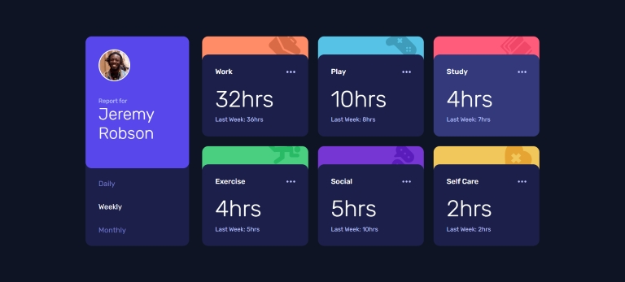

# Frontend Mentor - Time tracking dashboard solution

This is a solution to the [Time tracking dashboard challenge on Frontend Mentor](https://www.frontendmentor.io/challenges/time-tracking-dashboard-UIQ7167Jw). Frontend Mentor challenges help you improve your coding skills by building realistic projects.

## Table of contents

- [Overview](#overview)
  - [The challenge](#the-challenge)
  - [Screenshot](#screenshot)
  - [Links](#links)
- [My process](#my-process)
  - [Built with](#built-with)
  - [What I learned](#what-i-learned)
  - [Continued development](#continued-development)
- [Author](#author)

## Overview

### The challenge

Users should be able to:

- View the optimal layout for the site depending on their device's screen size
- See hover states for all interactive elements on the page
- Switch between viewing Daily, Weekly, and Monthly stats

### Screenshot

### Links

- Solution URL: [Solution](https://github.com/socratesioa/time-tracking-dashboard)
- Live Site URL: [Live Site](https://socratesioa.github.io/time-tracking-dashboard)

## My process

### Built with

- Semantic HTML5 markup
- CSS custom properties
- Flexbox
- CSS Grid
- Mobile-first workflow
- JavaScript

### What I learned

I learned to use fetch in order to dynamically populate the DOM. Very interesting and useful.

### Continued development

I'm eager to work on more JSON projects. I find it very interesting and it's also a really good chance to practice Javascript and DOM.

## Author

- Website - [My Portfolio](https://portfolio.thisissocrates.com)
- Frontend Mentor - [@socratesioa](https://www.frontendmentor.io/profile/socratesioa)
